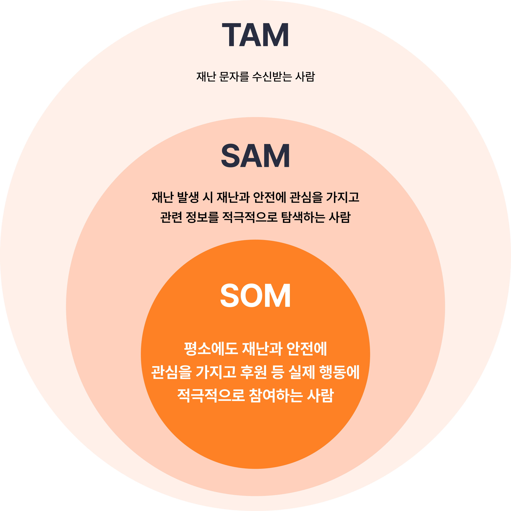
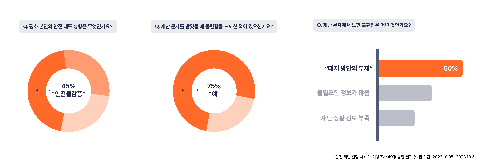
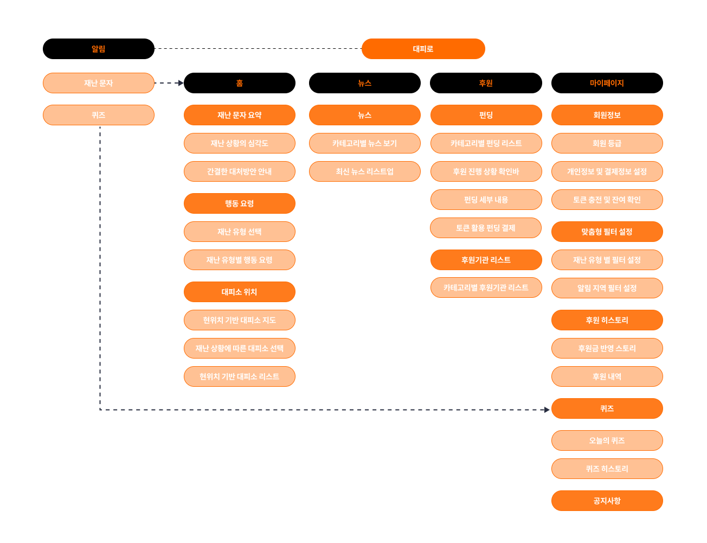
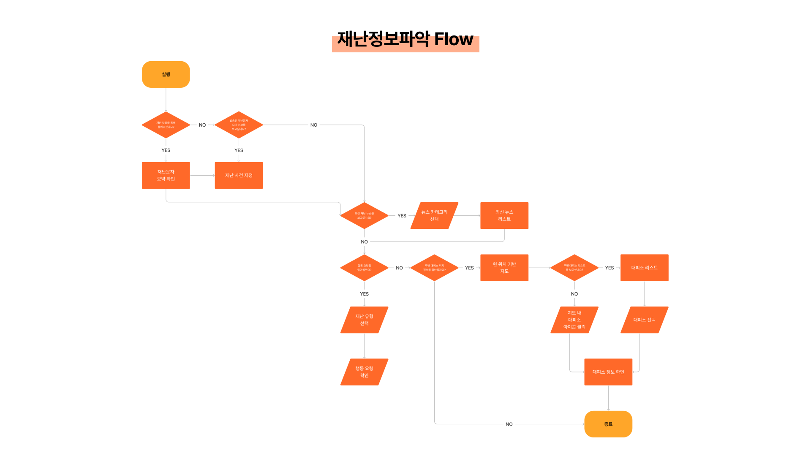
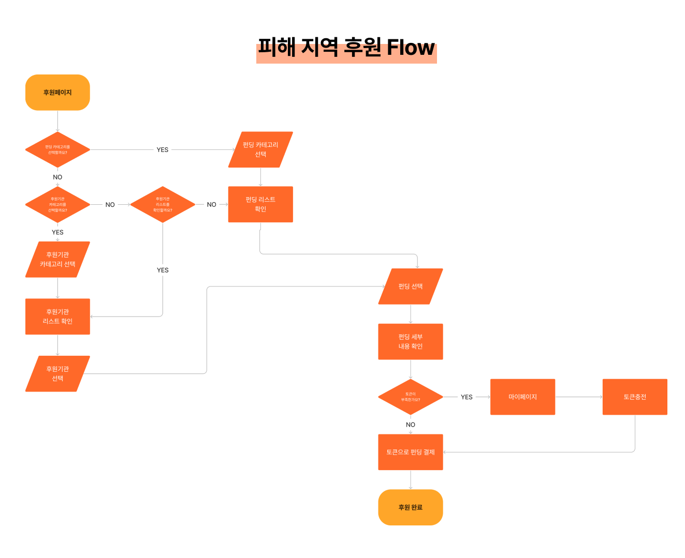
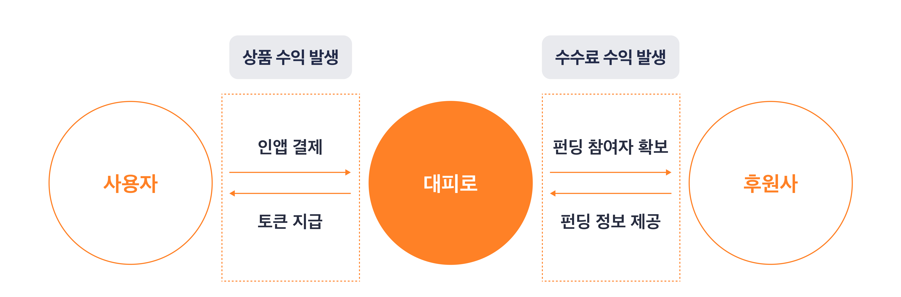

# 🌟 서비스명

 

## 서비스 소개
### 가장 안전한 길로, 대피로
‘대피로’는 위기 상황이 발생했을 때 정확한 정보를 제공하고 신속하게 대응할 수 있도록 돕는 안전•재난 알림 서비스입니다.
 
> 📢 **‘대피로’는 모든 이용자들에게 정확한 상황과 대응 방법을 제공하여, 위기 상황에 대한 혼란과 불안을 해소할 수 있길 기대합니다.**

 

## 🕊️ 팀명
### 연G와 I들

 

## R&R

| 분야 | 이름 | 포지션 |
| --- | --- | --- |
| 기획 | 김연지 | 📣 프로젝트 매니징, 서비스 기획, 시장 리서치 담당 |
| 기획 | 문성욱 | 💡 기획 리드, 서비스 기획, 와이어 프레임 담당 |
| 기획 | 송민호 | 🔑 서비스 기획, 데이터 분석 담당 |
| 디자인 | 한수현 | 🎨 서비스 디자인 담당, 프로토타입 |
| 개발 | 노영진 | 🔌 개발 리드, 서버 개발 담당 |
| 개발 | 이재현 | 🖥 서버 개발 담당 |
| 개발 | 송승희 | 📱 Android 개발 담당 |
| 개발 | 오종석 | 📐 Android 개발 담당 |

 

## 🔎 목적 및 필요성

### 목적

+ #### 기획 배경
    + 지난 5월 발생했던 북한 공습 경보 사건, 이태원 참사, 칼부림 사건 등 한국 사회는 다양한 위기 상황에 노출되어 있습니다. 위기 상황이 발생했을 때 대부분의 한국 사람들은 가볍게 여기거나 무시하기도 하며 위기 상황에 제대로 대처하지 못해 크고 작은 피해가 발생하고 있습니다. 안전에 대한 관심도는 상황 발생 시에 일시적으로 증가하며, 상황이 안정되면 안전 불감 상태로 전환됩니다. 안전 불감 상태가 지속되는 경우 동일한 상황이 다시 발생했을 때도 제대로 대처하지 못하게 되며 피해 발생을 초래합니다.
       
      
    + 현재 위기 상황이 발생하면 정부로부터 재난 문자가 발송되고, 국민들은 재난 문자를 통해 상황을 인지합니다. 재난 문자는 상황이 발생했을 때 즉시 발송되어 위기 상황을 신속히 인지할 수 있도록 합니다. 하지만 위기 상황에 대한 구체적인 정보와 대응 방법이 부재하고 지역에 따른 정보 불균형 문제 등으로 인해 재난 문자에 대한 불만이 커지고 있습니다.
       
    + 실제로 설문조사에서는 재난문자에 대한 불편함에 75%가 동의하고 있었으며, 그 중 50%는 재난문자에 상황에 대한 대처 방안이 없어 불편함을 느낀다고 응답하였습니다. 실제로 위기 상황에 따른 정확한 대응 방법을 알지 못해 크고 작은 피해가 발생하고 있습니다. 안전에 대한 대응 방법을 어렴풋이 알고는 있지만 정보에 대한 불신과 혼란으로 인해 실제 행동으로 이어지지 않습니다. 따라서 모든 국민의 안전을 위해 구체적인 정보와 대응 방법을 제공하고 실제 행동까지 이끌어주는 ‘안전 길라잡이’가 간절히 필요합니다.

 

### 문제정의 

| 문제 정의 | 서비스 기능 | 기대 효과 |
| ---  | --- | --- |
| - 예상되는 위험에도 정확한 방법으로 대응하지 못하는 사람들   - 정확하고 구체적인 정보 전달이 부족한 재난 문자 | - 정확한 대응 방법 제공   - 현위치 기반 대피소 위치 제공    |  - 정확한 정보를 실제 행동으로 옮길 수 있도록 도움  |
| - 재난 상황 발생 시 일시적으로 나타나는 안전 민감 상태 | - 안전 상식 및 대응 방법 퀴즈 컨텐츠 제공   - 안전 재난 관련 펀딩 기능  | - 안전에 대한 지속적인 관심과 적극적인 참여를 이끌어낼 수 있음 |

 

### 필요성

> 💡‘대피로’는 안전 재난 상황에 대한 구체적인 정보와 정확한 대응 방법을 제공하고, 추가적인 정보 탐색의 부담을 줄여, 위험 상황에서의 혼란과 불안감이 덜어지길 기대합니다.

 

> ✨‘대피로’는 일상 생활 시에 안전에 대한 다양한 콘텐츠를 제공해 지속적인 관심을 유도하고, 후원 기능을 통해 안전 재난 상황이 종료된 후에도 사용자들이 적극적으로 상황에 참여할 수 있도록 돕습니다.

 

## 📊 리서치 및 시장조사

 

### 1️⃣ 경쟁사 분석

  

|  | 🚨대피로 | 안전디딤돌 |  테러리스(WEB)  |  서울안전 | 생활안전지도 |
| --- | --- | --- | --- | --- | ---|
| 서비스 목적 |  안전 재난 알림 서비스 및 재난 대응 방법 제공 | 재난 문자 및 대응 방법 제공 |  전국 테러 예고 및 검거 정보 제공 | 재난 알림 및 대응 방법 제공  |  위치 기반 안전 지수 열람 기능 제공 |
| 핵심 제공 기능 | ● 재난 문자 요약 및 대응 방안 안내   ● 재난 카테고리별 뉴스   ● 현 위치 기반 대피소 지도   ● 안전 상식 및 행동 요령 퀴즈   ● 재난 카테고리별 펀딩/후원 기능  | ● 전국 재난 문자 열람   ● 현 위치 기반 대피소 지도   ● 국민 행동 요령   ● 재난 뉴스 | ● 지도기반 테러 예고   ● 검거 위치 정보 제공   ● 테러 제보하기  |  ● 재난속보   ● 재난통계   ● 시민 행동 요령   ● 안전 편의 시설 정보| ● 지역별 안전지수   ● 분야별 안전 지수   ● 주변 안전 시설물 정보| 
| 정보 제공 방식 | 이미지 + 짧은 텍스트(가독성 확보)  | 장문의 텍스트 | 아이콘 + 텍스트 |  장문의 텍스트  |  안전 수준 리포트  | 
| 유저 리텐션 유도 | 퀴즈와 펀딩 기능  | X | 정보 열람과 제보 기능 | X | X | 
| 뉴스 제공 여부 | O | O | O | X |  X | 
| 네트워크 연결 불가 상태 대안 제공 | 오프라인 행동요령 및 대피소 조회 화면 제공 | 오프라인 행동요령 및 대피소 조회 화면 제공 | X (웹기반으로 접근 불가) | X (무한로딩) | X (접근 불가) | 
| 알림 서비스 | 실시간 재난 문자를 활용한 추가적인 대응 방법 제공 | O | X | O | X | 

 

### 2️⃣ 목표 시장

| TAM | SAM | SOM |
| --- | --- | --- |
| 재난문자 수신하는 사람들 | 안전 알림 기능(위기 상황 발생 시 안전에 민감해지는 사람들) 안전에 대한 관심을가지고 적극적으로 정보를 찾아보는 사람 | 안전 알림 기능 + 후원 기능 (평소에도 안전과 관련한 정보 관심, 적극적으로 참여하려고 하는 사람)|

 

### 3️⃣ 유저리서치 분석

> 아래 그래프는 '안전 재난 알림 서비스' 설문조사 내용으로, 2023.10.05~2023.10.06 기간동안 수집한 40명의 설문 응답 중 유의미한 응답 내용을 정리한 지표입니다.
 

 

## 👀 서비스 타겟층 정의

> **서비스 타겟층은 대한민국 모든 국민이지만**, 이를 타겟의 연령대(10~40대, 50대 이상), 안전민감 성향에 따라 세분화할 수 있습니다.
 

> 아래는 세분화된 타겟과 그에 따른 관련 기능을 나타낸 표입니다.

 

### 1️⃣ 안전 민감 성향에 따른 분류 ###

|  | 안전 민감 성향 | 안전 불감 성향 |
| --- | --- | --- |
| 관련 기능 | ● 평상시에도 재난 대비 관련 퀴즈 콘텐츠 제공   ● 카테고리별 뉴스 제공   ● 정확한 관련 정보 제공 |  ● 재난 발생 시 효과적인 대응 방법 및 관련 정보 제공  |
| 기대 효과 | ● 많은 데이터 수집으로 인해 혼란스러움을 느끼는 안전 불감 성향을 띄는 사용자를 위해 객관적이고 정확한 정보를 전달하여 불안감을 해소해주길 기대  | ● 정보 수집의 필요성을 느끼지 못하는 안전 불감 성향의 사용자들에게 편리하게 데이터 수집을 할 수 있도록 돕고 필요한 정보를 제공하여 올바르게 대응할 수 있도록 도움   ● 퀴즈를 통해 안전에 대한 지속적인 관심을 이끌어낼 수 있도록 도움  |

 

### 2️⃣ 연령대에 따른 분류 ###

| | 10~40대 | 50대 이상 |
| --- | --- | --- |
| 관련 기능 | ● 효과적인 재난 대응 방법 제공   ● 퀴즈 콘텐츠를 통한 정보 제공   ● 뉴스 및 콘텐츠 공유 기능|  ● 효과적인 재난 대응 방법 제공   ● 카테고리별 뉴스 제공 (SNS, 커뮤니티 등에서 정보를 빠르게 획득하는데 어려움을 겪는 타겟)   ● 글씨 크기 설정, 화면 확대 기능  |

  

## 💡 서비스 소개

### **개요**
 
#### ‘대피로’는 신속한 알림보다 정확한 정보를 전달하는데 집중합니다

 

### 핵심 기능

| 기능 | 키워드 | 설명 |
| --- | :---: | --- |
| 정확한 재난/안전 알림 |🔎 Accuracy | ● 재난 및 안전에 대한 정확한 대응 방법을 확인합니다   ● 최근 재난/안전 관련 뉴스를 확인 할 수 있습니다 |
| 맞춤화된 재난/안전 정보 제공 | 🙂 Personalization | ● 맞춤형 필터를 통해 받고 싶은 알림 유형과 지역을 설정할 수 있습니다   ● 현재 위치 기반 지도를 통해 재난/안전이 발생한 혹은 영향이 있는 주변 위치를 확인하거나 주변 대피소/안전시설 위치를 확인합니다 |
| 피해 지역 후원 |🤝 Support| ● 토큰으로 후원하는 펀딩 방식을 통해 피해 지역에 도움을 줄 수 있습니다 |

 

### IA

 

### Flow chart

**재난 정보 파악**

 

**피해 지역 후원**

  

## 📊 서비스 비즈니스 모델

|  | 관련 파트너 1 | 관련 파트너 2 | 내용 |
| --- | --- | --- | --- |
| STEP 1 | 유저 | 대피로 | 토큰 발급을 위한 인앱 결제 |
| STEP 2 | 대피로 | 유저 | 1.지급된 토큰을 통한 펀딩 참여 및 추가 콘텐츠 이동 기회 부여   2. 충성 고객을 확보해 User Retention을 유지 및 상승시키는데 도움 |
| STEP 3 | 대피로 | 후원 | 펀딩 참여자 확보에 도움 |
| STEP 4 | 후원사 | 대피 | 수수료 지급 및 펀딩 관련 도움 제공  |

 

   

## **🎨 디자인 무드보드**

 
‘대피로’는 위기 상황이 발생했을때 정확하고 신속하게 대응할 수 있도록 돕는 안전•재난 알림 서비스입니다. 안전이라는 서비스 정체성을 살리며 신뢰성 상기시킬 수 있는 오렌지와 쿨그레이 컬러를 선정하였으며, 단순하고 직관적인 UI 디자인을 통해 사용자가 위기 상황을 정확하게 인지할 수 있도록 돕습니다.

  

## **💻 Technology**

## 🔍 System Architecture

## 💻 기술 스택
- Web
    - 
      
      

- Server
    - 
      
      
    - 
      
      
      
    - 
      
       

## 기술 스택 선정 이유
### 🎉 Android
* **Android Studio**   
안드로이드 애플리케이션 개발에 최적화된 통합 개발 환경(IDE)

* **Coroutine**   
네트워크 통신 과정에서 효율적인 비동기 처리를 위해 코루틴 사용

* **Android Jetpack**      
재사용 가능한 컴포넌트와 공통 아키텍처 가이드라인을 제공하여 안정적이고 일관된 앱 개발

* **Navigation**      
SAA(Single Acitivity Architecture) 구조에 적합한 화면 전환과 UI 구성 라이브러리

* **ViewModel**        
UI와 데이터 영역을 분리하고, 화면 전환에 따른 데이터 저장을 담당

* **Flow**         
Clean Architecture에서 LiveData 사용을 지양함에 따라 Flow로 대체

* **DataBinding**   
데이터와 UI를 연결하는 작업을 레이아웃(.xml)에서 처리하는 기술

* **Hilt**   
Android 환경에서 최적화된 DI(의존성 주입) 라이브러리

* **OkHttp & Retrofit2**   
REST API, HTTP 네트워크 통신 및 데이터베이스 접근에 사용되는 라이브러리

### 🎉 Backend

* **Spring Boot**       
스프링 프레임워크의 여러 기능을 쉽게 활용하여 안정적이고 확장 가능한 웹 애플리케이션을 구축하기 위함

* **JPA**         
핵심적인 비지니스 로직 개발에 집중할 수 있도록, 객체지향적인 관점에서 데이터베이스를 다루기 위함

* **Querydsl**           
복잡한 요구사항을 만족하기 위한 동적 쿼리 등을 쉽게 구현하기 위함

* **AWS RDS mysql**              
데이터베이스 인프라를 쉽게 구축하기 위해 AWS rds 를 사용함. 또한 상용화 된 RDBMS 중, 가장 대중화되어있고 레퍼런스가 풍부한 mysql 을 주 데이터베이스로 선정함

* **AWS S3 storage**                    
확장 가능한 백엔드 스토리지 솔루션으로서 데이터를 안전하게 저장하고 쉽게 관리하기 위함

* **Java 17**   
안정성을 보장하는 LTS(Long-Term Support) 버전이고, 팀원들의 기존 스택을 고려하여 JAVA 17 을 선정함

* **Spring Security**   
웹 애플리케이션의 보안 기능을 강화하며 사용자 인증 및 권한 관리를 손쉽게 제공하기 위함.

* **Redis**   
고성능의 인메모리 데이터 구조 저장소로, 캐싱 및 세션 관리 등 다양한 사용 사례에서 데이터의 빠른 조회와 저장을 위해 사용함

* **JWT**   
세션 관리 없이 사용자 인증 및 정보 전송을 위한 경량화된 토큰 방식을 사용하기 위함

## 🔖 Naming Rules
- 파일 : CamelCase + SnakeCase
- 클래스명 : PascalCase
- 함수/변수명 : CamelCase

## 📑 Commit Convention
커밋 메세지는 **커밋 태그(이슈 번호): 커밋 내용** 으로 작성  
ex) `git commit -m "Feat(#8): 로그인 기능 구현`
|커밋태그|설명|
|:---:|---|
|Feat|신규 기능 구현 작업|
|Fix|버그 수정|
|Docs|문서 수정|
|Style|코드 스타일 변경|
|Design|UI 디자인 변경|
|Refactor|코드 리팩토링|
|Rename|변수, 클래스, 메소드, 패키지명 변경|
|Build|dependencies 추가 및 삭제|
|Chore|기타 변경사항(빌드 관련, 패키지 매니징, CI/CD, assets 등)|
|Test|테스트 코드 추가|

## 🐬 Git Flow 전략

|브랜치명|설명|
|:---:|---|
|main|출시 또는 배포 가능한 코드의 브랜치|
|dev|다음 버전을 개발하는 브랜치|
|feat/[이름]|기능을 개발하는 브랜치|
|fix/[이름]|버그를 수정하는 브랜치|

